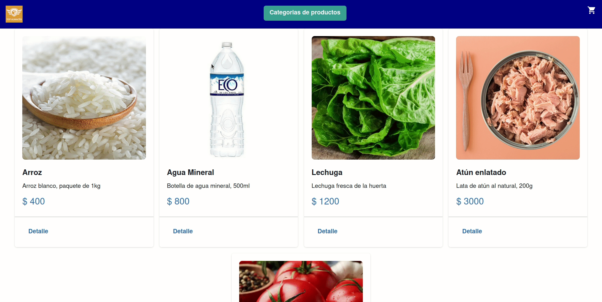
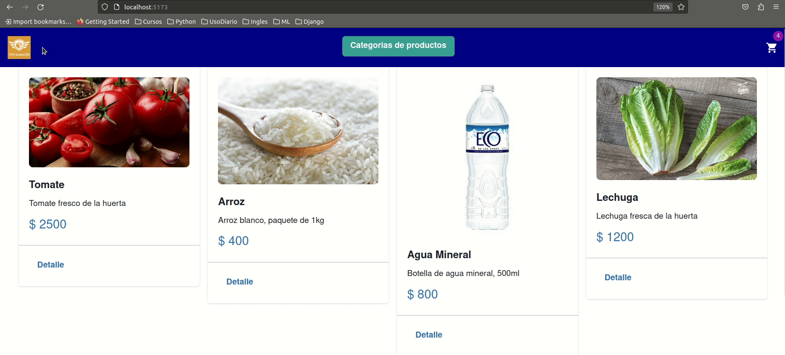

# Entrega-Final
- Para esta entrega se agregó el uso de context para la lógica del carrito.
- Se agregó el uso de firebase.
- Se agregó el uso de formulario para finalizar la compra.

# PreEntrega2-Aguada
- Para esta entrega se agregaron las rutas y los links correspondientes.
- Hubo una modificación dedependencias para salvar incompatibilidades.

# PreEntrega1-Aguada
Primera pre entrega del curso de React dictado por Coder House. Comisión: 58400

Para ejecutar el proyecto:
1 - npm install
2 - npm run dev
